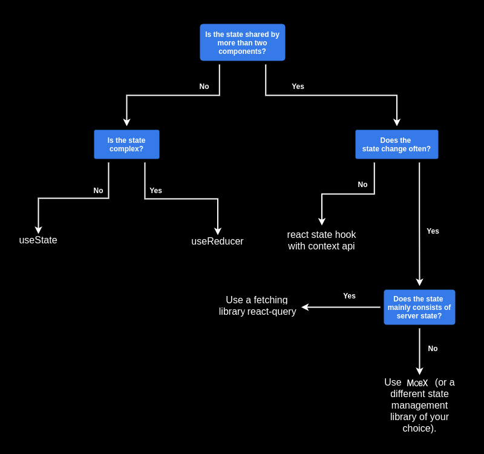

# Управление состоянием

## Типы состояний
Типы состояний в приложении и инструменты для работы с ними:
 - Server State (react-query(TanStack Query))
 - Navigation state (react-router)
 - Local UI state (useState, useReducer, MobX)
 - Global UI state (Context, MobX)

### Как выбрать подходящее решения для работы с состоянием в проекте?

### Полезные ссылки:
- [Mobx](https://mobx.js.org/)
- [TanStack Query(React Query)](https://tanstack.com/query/latest/docs/react/overview)
- [React State Management Cheat Sheet](https://rockiger.com/en/react-state-management/)